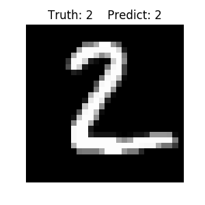

# A Convolutional Neural Network with One Hidden Layer

In this project, a convolutional neural network (CNN) with one hidden layer is implemented from scratch in Python. The model is trained using stocastic gradient descent (SGD) and evaluated on the MNIST dataset.

## Dependencies

```
numpy==1.16.4
h5py==2.9.0
matplotlib==3.1.0
```

## Dataset

The [MNIST](http://yann.lecun.com/exdb/mnist/) dataset is used to train and evaluate the neural network model in this project. It is a database of handwritten digits that is commonly used to train image processing models. The dataset in hdf5 format is included in the repository.

## Implementation

#### Activation functions

Rectified Linear Unit (ReLU) is defined as the activation function in this project. The evaluation of the `relu` function itself and its derivative are implemented as follow.

```python
def sigma(z, func):
    """
    Activation functions

    Parameters
    ----------
    z : ndarray of float
        input
    func : str
        the type of activation adopted

    Returns
    -------
    ZZ : ndarray of float
        output
    """
    if func == 'tanh':
        ZZ = np.tanh(z)
    elif func == 'sigmoid':
        ZZ = np.exp(z)/(1 + np.exp(z))
    elif func == 'relu':
        ZZ = np.maximum(z,0)
    else:
        sys.exit("Unsupported function type!")
    return ZZ
```
```python
def d_sigma(z, func):
    """
    Derivative of activation functions

    Parameters
    ----------
    z : ndarray of float
        input
    func : str
        the type of activation

    Returns
    -------
    dZZ : ndarray of float
        output
    """
    if func == 'tanh':
        dZZ = 1.0 - np.tanh(z)**2
    elif func == 'sigmoid':
        dZZ = np.exp(z)/(1 + np.exp(z)) * (1 - np.exp(z)/(1 + np.exp(z)))
    elif func == 'relu':
        dZZ = (z > 0).astype(int)
    else:
        sys.exit("Unsupported function type!")
    return dZZ
```

#### Softmax function

The softmax function is applied in the output layer of the neural network.
```python
def softmax_function(z):
    """
    Softmax function

    Parameters
    ----------
    z : ndarray of float
        input

    Returns
    -------
    ZZ : ndarray of float
        output
    """
    ZZ = np.exp(z)/np.sum(np.exp(z))
    return ZZ
```

#### 2D convolution

The convolution operation of a 2D matrix `A` and a filter `B` with multipe channels is implemented as follow.

> TODO: add padding and stride.

```python
def conv(A,B):
    """
    2D convolution with multiple channels

    Parameters
    ----------
    A : ndarray of float
        input
        shape = x_dim_of_input * y_dim_of_input

    B : ndarray of float
        convolution kernel
        shape = x_dim_of_kernel * x_dim_of_kernel * n_channels

    Returns
    -------
    ZZ : ndarray of float
        output
        shape = (x_dim_of_input - x_dim_of_kernel + 1) *
                (y_dim_of_input - y_dim_of_kernel + 1) *
                n_channels
    """
    dy, dx = A.shape # y-dim and x-dim of input
    ky, kx, C = B.shape # y-dim, x-dim, and num of channels of kernel
    ZZ = np.zeros((dy-ky+1,dx-kx+1,C))
    for p in range(C):
        for i in range(dy-ky+1):
            for j in range(dx-kx+1):
                ZZ[i,j,p] = np.sum(np.multiply(B[:,:,p],A[i:i+ky,j:j+kx]))
    return ZZ
```

#### Forward propagation

```python
def forward(X, model, func):
    """
    Forward propagation of the neural network

    Parameters
    ----------
    x : ndarray of float
        input
    model : dict
        parameters/weights of the nerual network
    func : str
        the type of activation

    Returns
    -------
    Z : ndarray of float
        output of the convolution layer
    H : ndarray of float
        output after the activation
    f : ndarray of float
        output of the forward propagation
    """
    Z = conv(X,model['K'])
    H = sigma(Z,func)
    U = np.zeros(model['W'].shape[0])
    for k in range(len(U)):
        U[k] = np.sum(np.multiply(model['W'][k,:,:,:],H))
    f = softmax_function(U)
    return (Z, H, f)
```

#### Backpropagation

```python
def backprop(X, y, f, Z, H, model, model_grads, func):
    """
    Backpropagation of the neural network

    Parameters
    ----------
    x : ndarray of float
        input
    y : ndarray of int
        ground truth label
    f : ndarray of float
        output of the forward propagation
    Z : ndarray of float
        output of the convolution layer
    H : ndarray of float
        output after the activation
    model : dict
        parameters/weights of the nerual network
    model_grads : dict
        gradients of the parameters/weights of the nerual network
    func : str
        the type of activation

    Returns
    -------
    model_grads : dict
        updated gradients of the parameters/weights of the nerual network
    """
    dU = - 1.0*f
    dU[y] = dU[y] + 1.0
    db = dU
    dW = np.zeros(model['W'].shape)
    for k in range(model['W'].shape[0]):
        dW[k,:,:,:] = dU[k] * H
    delta = np.zeros(model['W'].shape[1:])
    for p in range(model['W'].shape[-1]):
        for i in range(model['W'].shape[1]):
            for j in range(model['W'].shape[2]):
                delta[i,j,p] = np.dot(dU,model['W'][:,i,j,p])
    dZZ = d_sigma(Z,func)
    dZZ_delta = np.multiply(delta, dZZ)
    dK = conv(X,dZZ_delta)
    model_grads['W'] = dW
    model_grads['K'] = dK
    model_grads['b'] = db
    return model_grads
```

## Hyerparameters

The CNN is trained using stochastic gradient descent (SGD) algorithm. Staircase decaying strategy is used for learning rate scheduling.

The default hyperparameters are set as follow:

| Hyperparameter               | Value   |
| ---------------------------- |:-------:|
| Initial learning rate        | 0.01    |
| Learning rate decay factor   | 0.1     |
| Learning rate decay interval | 5       |
| Number of epochs             | 10      |
| Kernal size                  | 3 x 3   |
| Number of channels           | 3       |
| Activation function (sigma)  | ReLU    |

## Running the model

Run the following script to make sure required packages are installed.
```
pip install -r requirements.txt
```
To run a quick test of the pipeline with a smaller dataset (1/100 0f the original size) and a small number of training steps (1 epoch)
```
python main.py --quicktest
```
To run the model with the default hyperparameters
```
python main.py
```
To run the model with specified hyperparameters
```
python main.py --lr my_lr --decay my_decay --interval my_interval --n_epochs my_n_epochs --k_x my_k_x --k_y my_k_y --n_ch my_n_ch --sigma my_sigma
```
To see all available options and their descriptions
```
python main.py --help
```

## Result

With the default hyperparameters, the training and evaluation results are as follow.

```
Hyperparameters
-----------------
Initial learning rate : 0.0100
Learning rate decay : 0.1000
Staircase learning rate decay interval : 5
Number of epochs : 10
Kernal size : 3 x 3
Number of channels : 3
Activation function : relu

MNIST data info
----------------
Number of training data : 60000
Number of test data : 10000
Input data shape : 28 x 28 = 784
Output data shape : 10

Start training
---------------
Epoch   0,  Accuracy 0.9365
Epoch   1,  Accuracy 0.9659
Epoch   2,  Accuracy 0.9712
Epoch   3,  Accuracy 0.9751
Epoch   4,  Accuracy 0.9758
Epoch   5,  Accuracy 0.9845
Epoch   6,  Accuracy 0.9874
Epoch   7,  Accuracy 0.9887
Epoch   8,  Accuracy 0.9886
Epoch   9,  Accuracy 0.9893
Training Time : 6140.6342 (s)

Start testing
--------------
Test Accuracy : 0.9734
```

Examples of correctly predicted images





Examples of *incorrectly* predicted images


